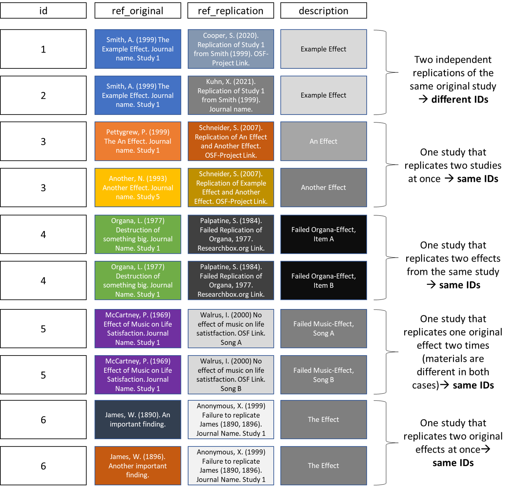

### Frequently Asked Questions

*Hint: Use Ctrl+F to search the FAQs.*

#### Q: Can I submit studies that I did not conduct myself?
A: Yes, you can! Entering other researchers' replication result will make you eligible for co-authorship on the App.

#### Q: Does the replication study that I want to submit need to be peer-reviewed?
A: No! Publishing replication studies can be met with quite some resistance, in our experience. Therefore, we want to keep the inclusion threshold as low as possible.

#### Q: In what way does the study need to be public or published?
A: There needs to be a way to verify that an entered study has indeed been executed (e.g., a pre-print, an OSF project with study materials, data, and some sort of results report).

#### Q: I know about replication studies that you have not added yet but I do not have time to add them myself. Is there a way to have you note these studies anyway?
A: Yes, please add them via this [Google form](https://docs.google.com/forms/d/e/1FAIpQLSeMCwdtP0TPgL55stniuyyTxnNwyC34mO4VUuLcQwYrLI89sQ/viewform) and send us a brief e-mail!

#### Q: What about large-scale replication projects such as Many Babies?
A: These are absolutely on our radar and we will add them as soon as possible. Please note that we are currently working with strongly limited resources. Get in touch if you want to support the project!

#### Q: Somebody entered my replication study. I want to become a contributor, is this still possible?
A: The basis of the replication database are other databases that have existed for years, so it is possible that your own study has already been entered. Still, there are hundreds of replications that are still missing or not sufficiently coded. To become a contributor, you need to code at least one replication study with its respective replication result. Get in touch if you need help identifying these studies.

#### Q: How do you make sure that nobody creates mock entries?
A: Each entry will be validated. To do this, there needs to be a published paper, a pre-print, an OSF-project, or some kind of findable object that includes the results that were entered.

#### Q: What is the definition of a replication study?
A: This one is tough: In a nutshell, current definitions allow calling almost all studies replications. With respect to the dataset: For a study to be considered a replication, the hypothesis that is being investigated needs to have been investigated in another study in a way that is as close as possible to your way and there needs to be at least one original study that the replication study tried to recreate. Moreover, the FORRT Replication Database only includes replications that use new data but not computational reproductions where the same data is used again. If you are unsure about whether there is sufficient overlap between an original study and the replication study, please let us know in the notes or get in touch with us.

#### Q: Is the database representative?
A: No. We strive to include every replication from the social, cognitive, and behavioral sciences in the database. If we succeed, the database will be comprehensive but researchers do not select target studies for replication on the basis of representativeness - they rather choose central and not yet replicated findings.

#### Q: How do I know the replication study entered here did not succeed due to methodological shortcomings?
A: You don't. We encourage you to check out individual entries and their methodologies (e.g., whether the replicators adhered to their preregistration and sticked closely to the original methods). You can also find replication attempts that did not yield any useful results (e.g., due to the target sample size not being achieved) because even recreating a study from what is reported and publishing the reconstructed or translated materials can help other researchers.

#### Q: What do I need to do to become a contributor on the website?
A: You need to enter results from at least one replication finding into the submission form or the spreadsheet, enter your e-mail so that we can contact you, and be available for potential questions during our validation of your entry. Sending us a reference of a replication of yours does not suffice.

#### Q: Do failed replication studies mean that original findings are untrustworthy?
A: No. Besides scientific misconduct or questionable research practices, replication attempts can fail due to practical reasons, due to unknown background factors, due to changes in (the perception of) concepts, and many more things.

#### Q: Can I take the dataset and use it for my research?
A: The FORRT Replication Database is open and shared under a CC-By Attribution 4.0 International license. Please cite us (see About-tab) if you use these resources. Reach out to us if you want to code a moderator and maybe we can join forces (some moderators have already been coded for parts of the data). Also, we are happy about feedback or knowing that other people can make use of this project!

#### Q: How is this project related to FORRT's Replications and Reversals? Should I enter my study in both places?
A: This project is a culmination of FORRT's Replications and Reversals and the Replication Database (ReD). Both projects have joined forces in late 2023 to create the FORRT Replication Database (FReD) and submission for Replications and Reversals has since stop. You can only enter results in FReD. 

#### Q: I want to enter a replication study that has an average effect size but also item-wise effects. Which should I enter in the FORRT Replication Database?
A: Both ways are possible. If it is possible for you, please enter the effect sizes as differentiated as possible. This will facilitate future analyses and better allow researchers, to determine how to successfully replicate prior research. If entering the results on an item-by-item basis is not possible for some reason, we are still very happy about you entering an aggregated effect size. In this case, please write into the note-variable, that more fine-grained results are available.

#### Q: What is the data structure? Can you account for dependent studies? Can there be multiple results for a single study?
A: Yes, we do account for multilevel structure / dependent effect sizes. Check out the Figure below for an in-depth explanation.

*Still confused? Send us an e-mail (see the About-tab for contact info)!*
